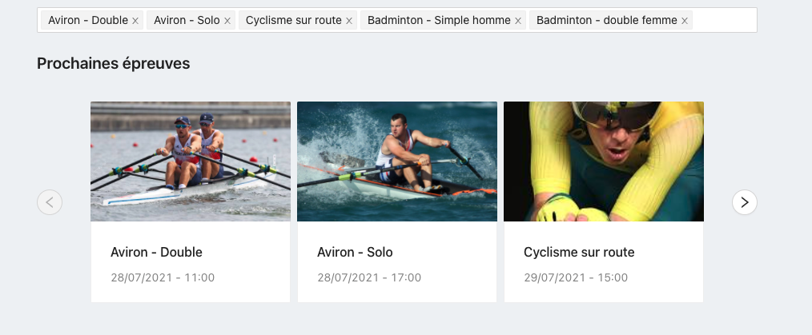
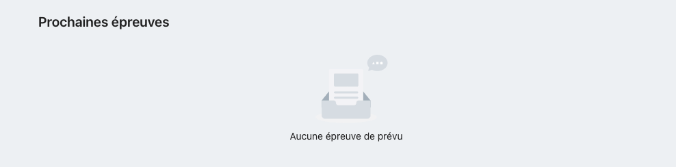
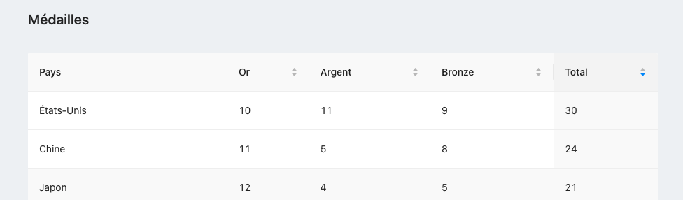

# Challenge Front: JO 2020

L'objectif de ce challenge est de reproduire la page suivante avec les élèments de la bibliotèque [Ant Design](https://ant.design/components/overview/).

Le défi est de ne pas utiliser de CSS (ou très peu) pour atteindre ce résultat.

## Data

Toute la data nécessaire se trouve dans le fichier `data.json`.

## Filtre et prochains évènements

Cette section contient un `Select` qui regroupe les différents sports qui se trouvent dans les `nextEvents`.
La sélection que tu feras dans ce sélecteur va influencer l'affichage des prochains évènements qui s'affichent en dessous.

La liste affiche 3 évènements à la fois. Deux boutons sont présents pour passer aux 3 suivants ou aux 3 précédents.
Ils devront être désactivés si il n'y a pas d'évènements (avant ou après).

Si aucun évènement ne ressort, afficher ceci:

> Le format de la date est donnée en Timestamp. [Moment.js](https://momentjs.com) sera ton ami.

## Médailles

Ici l'objectif est afficher un tableau qui affiche le nombre de médailles gagnées par chaque pays. Il sera par défaut trié par le total de médailles, dans l'ordre décroissant. Il sera aussi possible de le trier par la colonne `Or`, `Argent` et `Bronze`.

# Partage du résultat

Concernant le partage du résultat, il est préférable de travailler sur un fork de ce repo :

Puis de m'envoyer son lien sur tristan@monqualiticien.com.

Tu as une semaine pour réaliser cette page.

N'hésite pas à me demander si il y a un point que tu ne comprends pas.

Regarde bien les composants proposés par [Ant Design](https://ant.design/components/overview/) et réalise cette page avec comme but de te rapprocher au maximum de ce résultat.

## Notes de l'auteur

Ce sujet pré-suppose d'une installation de node et de yarn au préalable.
Si tu n'as jamais utilisé yarn, sache simplement que la commande `yarn` effectuera l'installation des dépendances décrites dans le package.json, et que `yarn start` lancera l'application web.
React testing library est configuré et utilisable via `yarn test` pour ton confort, mais le coverage de l'application n'est pas demandé.

Enjoy!
